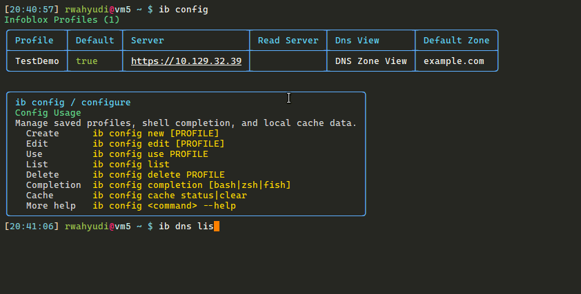

# gib

`ib` a fast, lightweight , operator-focused single binary CLI for managing
Infoblox DNS records without living in the web UI. It keeps Ad-Hoc & day-to-day
DNS work close to the shell, super fast and extremely easy.




The CLI is designed with performance in mind.  Read-heavy workflows use a
validated Grid Master Candidate when available.  Record listing and search use
various caching techniques and multi threading to ensure snappy experience.


## Features

- Profile management for creating, editing, switching, and deleting multiple Infoblox
  profiles with encrypted local passwords.
- Safe read/write routing: GET requests can use a validated GCM read endpoint,
  while POST, PUT, and DELETE stay on the primary Grid Master.
- DNS context from configured defaults, shell-session view/zone context,
  environment variables, or one-command `--view` and `--zone` overrides.
- DNS record workflows for listing, searching, creating, editing, and deleting
  records, including filtering, field sorting, selected output columns,
  interactive duplicate selection, and confirmation.
- IPAM read workflows for network views, IPv4 network list/search/details,
  address details, and next available IP lookup with network-view selection.
- Large-zone performance through `/allrecords`, local SQLite caching,
  worker-limited global search, and stale-while-revalidate refreshes.
- Dynamic shell completion for profiles, views, zones, records, flags, record
  types, and output formats from the live `ib` binary.
- Compact operator output with colorful tables, current-context footers,
  JSON/CSV output, and progress display for larger searches.

## Security Scanning

GitHub Actions runs tests,
[govulncheck](https://pkg.go.dev/golang.org/x/vuln/cmd/govulncheck),
[gosec](https://github.com/securego/gosec), and
[Trivy](https://github.com/aquasecurity/trivy) filesystem scans on pushes,
pull requests, and a weekly schedule.
[Dependabot](https://docs.github.com/en/code-security/dependabot) monitors Go
modules and GitHub Actions updates weekly.

Run the same checks locally when the tools are installed:

```bash
env GOCACHE=/tmp/go-build GOMODCACHE=/tmp/go-mod go test ./...
scripts/check-licenses.sh
env GOCACHE=/tmp/go-build GOMODCACHE=/tmp/go-mod govulncheck ./...
gosec ./...
trivy fs --scanners vuln,secret,license .
```

## Installation From Copr

The Fedora/EPEL package name is `gib`; it installs the CLI as `/usr/bin/ib`.

```bash
sudo dnf install dnf-plugins-core
sudo dnf copr enable rwahyudi/gib
sudo dnf install gib
ib --help
```

RPM packaging sources are in [`gib.spec`](gib.spec),
[`go-vendor-tools.toml`](go-vendor-tools.toml), and
[`packaging/rpm/README.md`](packaging/rpm/README.md). Start with the EPEL 10
Copr chroot; add EPEL 9 only after confirming that its buildroot has a Go
toolchain new enough for this module.

## Installation From GitHub Release

Download packages from the [latest GitHub release](https://github.com/rwahyudi/gib/releases/latest).

Standalone binary:

```bash
curl -LO https://github.com/rwahyudi/gib/releases/download/v0.1.0/ib_0.1.0_linux_amd64.tar.gz
tar -xzf ib_0.1.0_linux_amd64.tar.gz ib
sudo install -m 0755 ib /usr/local/bin/ib
ib --help

# Optional: install Bash autocomplete for all users.
sudo mkdir -p /etc/bash_completion.d
ib config completion bash | sudo tee /etc/bash_completion.d/ib >/dev/null
```

Open a new shell after installing the completion file, or source it directly with
`. /etc/bash_completion.d/ib`.

RHEL derivatives:

```bash
curl -LO https://github.com/rwahyudi/gib/releases/download/v0.1.0/ib_0.1.0_linux_amd64.rpm
sudo dnf install ./ib_0.1.0_linux_amd64.rpm
ib --help
```

Debian derivatives:

```bash
curl -LO https://github.com/rwahyudi/gib/releases/download/v0.1.0/ib_0.1.0_linux_amd64.deb
sudo apt install ./ib_0.1.0_linux_amd64.deb
ib --help
```

RPM and DEB packages install `ib` to `/usr/local/bin/ib` and install Bash completion to `/etc/bash_completion.d/ib`. Open a new shell after package installation to load completion.

## Installation on Windows

Native Windows release builds are published as portable ZIP archives. Download
the Windows ZIP from the [latest GitHub release](https://github.com/rwahyudi/gib/releases/latest),
extract `ib.exe`, and place it on your user `PATH`:

```powershell
$version = "0.3.2"
$archive = "ib_${version}_windows_amd64.zip"
$url = "https://github.com/rwahyudi/gib/releases/download/v$version/$archive"

Invoke-WebRequest -Uri $url -OutFile $archive
Expand-Archive ".\$archive" -DestinationPath ".\ib-$version" -Force

$userBin = Join-Path $HOME "bin"
New-Item -ItemType Directory -Force $userBin | Out-Null
Copy-Item ".\ib-$version\ib.exe" (Join-Path $userBin "ib.exe") -Force

$userPath = [Environment]::GetEnvironmentVariable("Path", "User")
if (($userPath -split ";") -notcontains $userBin) {
  $newPath = ($userPath.TrimEnd(";") + ";$userBin").TrimStart(";")
  [Environment]::SetEnvironmentVariable("Path", $newPath, "User")
}
```

Open a new PowerShell window after updating `PATH`, then verify the install:

```powershell
ib --help
ib config new --default
```

If you prefer to build from source, install Go 1.24 or newer and build
`ib.exe` locally:

```powershell
winget install GoLang.Go
git clone https://github.com/rwahyudi/gib.git
cd gib

$env:GOCACHE = "$env:TEMP\go-build"
$env:GOMODCACHE = "$env:TEMP\go-mod"
go build -buildvcs=false -o ib.exe .\cmd\ib

$userBin = Join-Path $HOME "bin"
New-Item -ItemType Directory -Force $userBin | Out-Null
Copy-Item .\ib.exe (Join-Path $userBin "ib.exe") -Force

$userPath = [Environment]::GetEnvironmentVariable("Path", "User")
if (($userPath -split ";") -notcontains $userBin) {
  $newPath = ($userPath.TrimEnd(";") + ";$userBin").TrimStart(";")
  [Environment]::SetEnvironmentVariable("Path", $newPath, "User")
}
```

Native Windows profile passwords are encrypted with user-scope Windows DPAPI.
Run `ib config completion windows` in PowerShell to install native completion
for the current user, then open a new PowerShell window. Bash, Zsh, and Fish
completion can still be generated for WSL, Git Bash, or MSYS2.

## Setup

Create or edit an Infoblox profile:

```bash
ib config new --default
ib config edit
ib config list
```

Profiles store the primary server, auto-detected GCM read endpoint when available, credentials, WAPI version, DNS view, and default zone. If Infoblox returns only one DNS view or one eligible primary forward zone, config selects it automatically. Passwords are encrypted at rest. Unix builds use a local `~/.ib/key`; native Windows builds use user-scope DPAPI for new writes and can still read existing `enc:v1` key-file profiles. Do not commit `~/.ib/config`, `~/.ib/key`, or cache data.

## DNS 

DNS commands use this context order:

```text
command --zone/--view -> ib dns zone/view use -> IB_ZONE/IB_VIEW -> configured defaults
```

On native Windows, `ib dns zone use` and `ib dns view use` store the same session context files under the user's local app data directory. Run `ib config completion windows` to install the PowerShell integration that passes `IB_SHELL_PID`; shells without that integration should use `IB_ZONE` / `IB_VIEW` or command flags for explicit context.

Override context for one command without saving it:

```bash
ib dns --zone example.com --view "DNS Zone View" list
ib dns --zone example.com create app host 192.0.2.10 -c "Application host"
ib dns --view "DNS Zone View" search app
```

## Global Switches

- `-o, --output table|json|csv` is available from the root command and applies
  to every command. Use `csv` for spreadsheet/script exports, or `json` when
  piping to tools such as `jq`.
- `-z, --zone ZONE` and `-v, --view VIEW` are available on `ib dns` and most
  subcommands. They override the current DNS context for one command only.
  `ib dns zone list` intentionally accepts only `--view` because it lists zones
  in a DNS view rather than records inside one zone.
- `-g, --global` is a search scope switch for `ib dns search`; it searches every
  searchable zone in the selected DNS view.

## Modules

| Module | Purpose | Start here |
| --- | --- | --- |
| `config` | Manage profiles, encrypted credentials, completion, and local cache. | `ib config new --default` |
| `dns` | Manage Infoblox DNS views, zones, records, searches, and context overrides. | `ib dns list` |
| `net` | Manage IPAM network views, IPv4 networks, addresses, and next-IP lookups. | `ib net list` |

## How It Works

`cmd/ib/main.go` starts the Cobra CLI and hands command behavior to `internal/ibcli`. Profile loading decrypts the stored password, resolves the current DNS view/zone, and builds a WAPI client. GET requests can use a configured GCM read endpoint, while create, update, and delete requests always use the primary server.

DNS listing/search and IPAM read workflows prefer local SQLite cache rows. Freshness is calculated from `cached_at + cache_ttl`; stale rows inside `records_cache_swr_ttl` are returned immediately while one detached refresh process updates the cache. DNS records revalidate with the zone serial before refreshing `/allrecords`; IPAM cache refreshes skip serial checks and re-download the relevant WAPI object.

Code comments are intentionally concentrated around routing, config validation, cache/SWR, leases, completion, and background refresh handoff. Update those comments in the same change whenever the related behavior changes.

For a deeper explanation with diagrams, see [Performance & Caching](docs/performance-caching.md), which includes Nord-styled cache decision, read/write worker-flow, and SQLite table diagrams.

## Libraries Used

- [Cobra](https://github.com/spf13/cobra) provides the command tree, flags, and
  shell completion protocol.
- [pflag](https://github.com/spf13/pflag) handles POSIX-style long and short
  flags underneath Cobra.
- [Lipgloss](https://github.com/charmbracelet/lipgloss) styles tables, context
  footers, and operator-facing messages.
- [Bubble Tea](https://github.com/charmbracelet/bubbletea) and
  [Bubbles](https://github.com/charmbracelet/bubbles) power interactive progress
  and list-style terminal UI.
- [Huh](https://github.com/charmbracelet/huh) provides confirmation and select
  prompts for destructive or ambiguous actions.
- [go-sqlite3](https://github.com/mattn/go-sqlite3) stores local zone and record
  cache data in SQLite.
- [go-isatty](https://github.com/mattn/go-isatty) detects interactive terminals
  so scripts keep clean output.
- [GoReleaser](https://goreleaser.com/) builds release binaries, the Windows
  ZIP archive, and Linux RPM/DEB packages.

## Command Reference

### Config

| Command | Description |
| --- | --- |
| `ib config` | Show profile overview and short usage. |
| `ib config new [PROFILE]` | Create a profile; validates primary access, auto-detects a usable GCM read endpoint, and selects single DNS view/zone choices automatically. |
| `ib config edit [PROFILE]` | Edit an existing profile; leaving the password blank keeps the current encrypted password. |
| `ib config list` | List configured profiles and their default/read endpoint context. |
| `ib config use PROFILE` | Set the default profile. |
| `ib config delete PROFILE` | Delete a non-default profile and clear its local cache rows. |
| `ib config completion [bash\|zsh\|fish\|windows]` | Generate or install dynamic shell completion. |
| `ib config cache status` | Show local SQLite cache entries with table statistics, or structured statistics with `-o json`. |
| `ib config cache clear` | Clear local SQLite cache entries. |

### DNS

| Command | Description |
| --- | --- |
| `ib dns` | Show DNS help and the current profile/view/zone context. |
| `ib dns list [ZONE]` | List records in the current or provided zone. Add `-r` to include child zones, `-t/--type` to filter record types, `-e/--exclude` to hide matching records, `-s/--sort FIELD` to sort, or `-C/--columns LIST` to print selected columns. |
| `ib dns search KEYWORD` | Search records by name, value, or comment. Use `--global` for all searchable zones, `-r` for child zones under the current/root zone, `-s/--sort FIELD` to sort, or `-C/--columns LIST` to print selected columns. |
| `ib dns next-ip NETWORK` | Compatibility path for next available IPv4 address lookup. Prefer `ib net next-ip NETWORK` for IPAM work. |
| `ib dns create NAME TYPE VALUE` | Create a DNS record, for example `ib dns create app host 192.0.2.10 -c "Application host"`. |
| `ib dns edit NAME [TYPE] [VALUE]` | Edit an existing DNS record. |
| `ib dns delete NAME [ZONE]` | Delete a DNS record; prompts for confirmation unless `-y` is used. |
| `ib dns view list` | List DNS views. |
| `ib dns view use VIEW` | Set the active DNS view for the current shell session. |
| `ib dns zone create ZONE` | Create an authoritative DNS zone. |
| `ib dns zone list [SEARCH]` | List authoritative DNS zones. Add `-t/--type` to filter zone formats, `-e/--exclude` to hide matches, `-s/--sort FIELD` to sort, or `-C/--columns LIST` to print selected columns. |
| `ib dns zone info ZONE` | Show DNS zone details, with SOA serial rendered as an integer. |
| `ib dns zone delete ZONE` | Delete an authoritative DNS zone. |
| `ib dns zone use ZONE` | Set the active DNS zone for the current shell session. |

### IPAM

| Command | Description |
| --- | --- |
| `ib net` | Show IPAM command help. |
| `ib net view list` | List IPAM network views. |
| `ib net list [SEARCH]` | List IPv4 networks. Add `--network-view` to filter by IPAM network view, `-s/--sort FIELD` to sort by `network`, `network_view`, or `comment`, and `-C/--columns LIST` to print selected columns. |
| `ib net search KEYWORD` | Search IPv4 networks by CIDR, network view, or comment. |
| `ib net show NETWORK` | Show details for one IPv4 network. Use `--network-view` when a CIDR exists in multiple network views. |
| `ib net address IP` | Show IPAM details for an IPv4 address, including network, status, types, names, MAC address, lease state, and comment when available. |
| `ib net next-ip NETWORK` | Find the next available IPv4 address in a network. Use `--network-view` for ambiguous CIDRs, `-n/--num` for multiple addresses, and repeat `-e/--exclude` to skip addresses. |

Common examples:

```bash
ib dns view list
ib dns view use "DNS Zone View"
ib dns zone list
ib dns zone use example.com
ib dns list
ib dns search app
ib net view list
ib net list prod --network-view default
ib net address 192.0.2.10 --network-view default
ib net next-ip 192.0.2.0/24 -n 3
ib dns create app host 192.0.2.10 -c "Application host"
ib dns edit app host 192.0.2.20 -t 300 -c "Application host"
ib dns delete app
```

`ib dns list` and `ib dns search` operate on the current zone by default. Add `-r` or `--recursive` to include child zones. `ib dns list` also supports `-t/--type` and `-e/--exclude` filters like search. Add `-s` or `--sort` to sort by `name`, `type`, `value`, `zone`, `ttl`, or `comment`; a blank `--sort` sorts by name, and a leading minus sorts descending, for example `--sort=-name`. Add `-C` or `--columns` to print selected columns from `type`, `name`, `value`, `zone`, `ttl`, and `comment`, for example `--columns name,value`. `ib dns search --global` searches every searchable zone in the selected view.

`ib dns zone list` supports the same output control pattern for zones. `--type` filters zone formats `FORWARD`, `IPV4`, or `IPV6`; `--sort` accepts `zone`, `view`, `format`, `ns_group`, or `comment`; and `--columns` selects from the same zone fields. Use `--view` to list zones from another DNS view; `--zone` and `-z` are not accepted by this command.

`ib net list` and `ib net search` are read-only IPAM workflows. They query the WAPI `network` object, optionally filter by `--network-view`, and match search text against network CIDR, network view, and comment. Add `-s` or `--sort` to sort by `network`, `network_view`, or `comment`; a blank `--sort` sorts by network, and a leading minus sorts descending. Add `-C` or `--columns` to select from `network`, `network_view`, and `comment`.

`ib net next-ip` performs the network lookup with read-only routing, then sends the `next_available_ip` function call to the primary server. `ib dns next-ip` remains available for existing scripts, but `ib net next-ip` is the IPAM-oriented command.

`ib dns delete` prompts before deleting. Use `-y` or `--yes` to skip the confirmation. If multiple records match, interactive table mode shows a Huh select list so one record can be chosen.

#### Output Controls

Record, zone, and network list-style commands can sort rows, select columns,
and emit machine-readable output:

```bash
ib dns list --sort name --columns name,value,ttl
ib dns list --sort=-name --columns zone,name,value -o csv
ib dns search app --global --sort zone --columns zone,name,value -o csv
ib dns list -o json | jq -r '.[] | [.name, .value] | @tsv'
ib dns zone list --sort zone --columns zone,format,comment -o json | jq '.[]'
ib net list --sort network --columns network,comment -o json | jq '.[]'
```

Use `--sort FIELD` for ascending order and `--sort=-FIELD` for descending
order. Record fields are `name`, `type`, `value`, `zone`, `ttl`, and `comment`;
zone fields are `zone`, `view`, `format`, `ns_group`, and `comment`; network
fields are `network`, `network_view`, and `comment`. Use `--columns` or `-C`
with a comma-separated list to keep only the fields you need. Use `-o csv` for
CSV output, or `-o json` when the next step is a `jq` pipeline.


## Troubleshooting

If a DNS write reports a non-JSON WAPI response, `ib` prints the WAPI object,
HTTP status, content type, and a short response snippet. An HTML snippet usually
means the configured server, WAPI version, credentials, or a proxy/login page is
answering the WAPI request instead of Infoblox JSON.

## Cache

Zone, record, and IPAM caches are stored in `~/.ib/cache.sqlite3`.

Record and IPAM cache freshness uses `cached_at + cache_ttl`. Expired records and IPAM rows inside `records_cache_swr_ttl` are returned immediately while a single background refresh process updates the cache. DNS records revalidate the zone serial before refreshing `/allrecords`; IPAM rows skip serial checks and refresh the relevant `networkview`, `network`, or `ipv4address` WAPI data.

Multi-zone search preloads matching record-cache rows with one SQLite connection before workers start. Workers still fall back to per-zone cache/WAPI checks for missing or expired rows. The WAPI HTTP client keeps a larger per-host connection pool sized from `dns_search_worker_limit` so parallel search can reuse TLS connections instead of repeatedly reconnecting.

When cache is missing or already outside the stale window, list/search waits up to `max_background_worker_wait` seconds for an active background refresh of the same profile and cache scope before doing foreground WAPI refresh work.

`ib net next-ip` can use cached network rows to find the target network `_ref`, but the `next_available_ip` function call is always sent live to the primary server so returned addresses are current.

Shell completion prefetches cache freshness in the background by default. With `completion_cache_prefetch = true`, DNS completion checks the current DNS view and zone, and network CIDR completion checks the selected IPAM network view, then starts lease-protected zone-list, current-zone record, or network-list refresh helpers when cache rows are missing or stale. Completion returns local cached rows when available, including stale rows, and does not perform foreground Infoblox refresh work. Set `completion_cache_prefetch = false` in `[meta]` to make completion read local cache only and skip background refresh starts.

`ib config cache status` keeps the detailed cache row table and adds a colored
summary footer for table output: cache entries, cached records, fresh entries,
network views, networks, IPv4 addresses, SWR-stale entries, expired entries,
and active refreshes. With `-o json`, it
returns `statistics` and `entries`; with `-o csv`, output remains row-only for
scripts.

Successful DNS record create, edit, and delete operations clear the affected zone's record cache and start a background refresh. DNS zone create/delete also refreshes the zone-list cache in the background; deleted zones have their record cache removed.

Useful cache commands:

```bash
ib config cache status
ib config cache clear
```

To see whether search used cache or WAPI, run with persistent cache-source diagnostics:

```bash
IB_SEARCH_DEBUG=1 ib dns search app --global
```

PowerShell:

```powershell
$env:IB_SEARCH_DEBUG = "1"; ib dns search app --global
```

Deleting a profile also clears local cache rows for that profile.

## Completion

Generate dynamic shell completion:

```bash
ib config completion bash > ~/.ib-complete.bash
. ~/.ib-complete.bash
```

On Windows, install native PowerShell completion for the current user:

```powershell
ib config completion windows
```

Run the Windows installer again after upgrading `ib` if completion behavior
changes. It updates the normal PowerShell profile paths plus common OneDrive
Documents profile locations. If `ib dns <Tab>` offers `dns` instead of DNS
subcommands, replace `ib.exe`, rerun `ib config completion windows`, and open a
new PowerShell window so the updated script is loaded.

The generated or installed completion calls the live `ib` binary, so profiles, zones, records, IPAM networks, flags, and output formats are resolved dynamically.
Installing from RPM or DEB puts the Bash completion file in `/etc/bash_completion.d/ib`.

## License

`gib` is licensed under the MIT License. See [LICENSE](LICENSE). Binary release
archives also include [THIRD_PARTY_LICENSES.md](THIRD_PARTY_LICENSES.md) for
bundled Go dependency notices. The dependency policy is documented in
[docs/licensing.md](docs/licensing.md).
