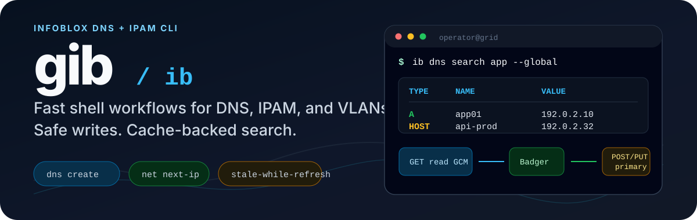
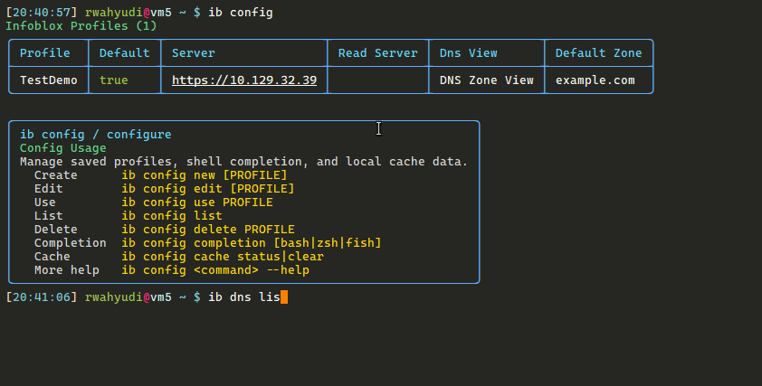
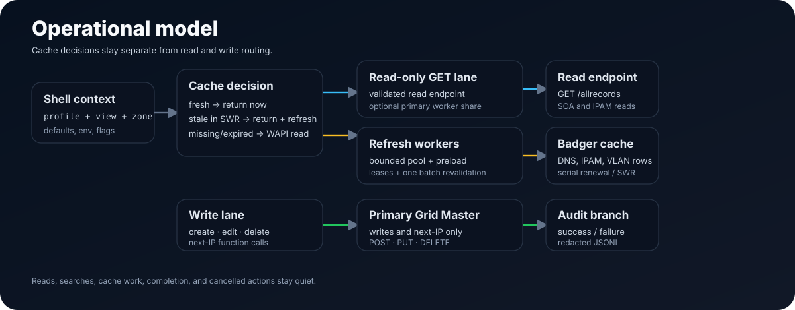

<p align="center">
  
</p>

<p align="center">
  <a href="https://github.com/rwahyudi/gib/releases/latest"></a>
  
  <a href="LICENSE"></a>
</p>

`gib` installs the `ib` command: a lightweight, operator-focused CLI for Infoblox DNS and IPAM work from the shell.

It is built for daily record and network tasks: compact tables for humans, plain JSON/CSV for automation, safe read/write routing, dynamic completion, and cache-backed searches that stay responsive on large zones.

<p align="center">
  
</p>

## What `ib` helps you do

- Manage local and Linux-global Infoblox profiles with encrypted credentials.
- Work in the right DNS context from saved defaults, shell-session view/zone state, environment variables, or one-command `--view` and `--zone` overrides.
- List, search, create, edit, and delete DNS records with type filters, exclusions, sorting, selected columns, duplicate selection, and confirmation.
- Read IPAM network views, IPv4 networks and containers, addresses, VLAN assignments, and next available IPs.
- Route read-only GET requests to a validated Grid Master Candidate while keeping POST, PUT, DELETE, and next-IP function calls on the primary Grid Master.
- Use Badger-backed zone, record, IPAM, and VLAN caches with bounded workers and stale-while-revalidate refreshes.
- Generate dynamic shell completion for profiles, views, zones, records, networks, record types, flags, columns, and output formats.
- Emit optional JSON Lines audit events for successful DNS/config writes while keeping read workflows quiet.

## Install

For Fedora or EPEL, Copr is the shortest path when you want a distro-built package. The package is named `gib` and installs the command as `/usr/bin/ib`.

```bash
sudo dnf install dnf-plugins-core
sudo dnf copr enable rwahyudi/gib
sudo dnf install gib
```

GitHub release assets use stable filenames, so `/releases/latest/download/...` always points at the newest published version. Linux release assets are built with `CGO_ENABLED=0`, so they do not require a specific glibc version.

Linux tarball:

```bash
curl -fL https://github.com/rwahyudi/gib/releases/latest/download/ib_linux_amd64.tar.gz | tar -xz ib
sudo install -m 0755 ib /usr/local/bin/ib
ib -v
ib --help
```

RPM or DEB package:

```bash
curl -fLO https://github.com/rwahyudi/gib/releases/latest/download/ib_linux_amd64.rpm
sudo dnf install ./ib_linux_amd64.rpm

curl -fLO https://github.com/rwahyudi/gib/releases/latest/download/ib_linux_amd64.deb
sudo apt install ./ib_linux_amd64.deb
```

RPM and DEB packages install `ib` to `/usr/local/bin/ib` and Bash completion to `/etc/bash_completion.d/ib`. For the tarball, install completion manually:

```bash
sudo mkdir -p /etc/bash_completion.d
ib config completion bash | sudo tee /etc/bash_completion.d/ib >/dev/null
```

Open a new shell after installing completion.

Windows ZIP:

```powershell
New-Item -ItemType Directory -Force "$HOME\bin" | Out-Null
$archive = "$env:TEMP\ib_windows_amd64.zip"
Invoke-WebRequest "https://github.com/rwahyudi/gib/releases/latest/download/ib_windows_amd64.zip" -OutFile $archive
Expand-Archive $archive "$HOME\bin\ib-latest" -Force
Copy-Item "$HOME\bin\ib-latest\ib.exe" "$HOME\bin\ib.exe" -Force
$binPath = Join-Path $HOME "bin"
$userPath = [Environment]::GetEnvironmentVariable("Path", "User")
if (($userPath -split ';') -notcontains $binPath) {
    [Environment]::SetEnvironmentVariable("Path", (($userPath, $binPath | Where-Object { $_ }) -join ';'), "User")
}
if (($env:Path -split ';') -notcontains $binPath) {
    $env:Path = (($env:Path, $binPath | Where-Object { $_ }) -join ';')
}
```

Open a new PowerShell window so the user `PATH` change is loaded, then run `ib config completion windows`. For source builds, see [Build From Source](docs/build-from-source.md). For publishing, see [Release Process](docs/release-process.md).

## First run

Create a profile, choose the active DNS context, then run the first read:

```bash
ib config new --default
ib dns view use "DNS Zone View"
ib dns zone use example.com
ib dns list
```

Profiles store the primary server, auto-detected WAPI version, optional validated GCM read endpoint, credentials, DNS view, default zone, and audit logging settings. Passwords are encrypted at rest. Unix builds use a key file; native Windows builds use user-scope DPAPI for new writes and can still read existing `enc:v1` key-file profiles.

Local profiles live under `~/.ib/`. On Linux, `sudo ib config new --global-config [PROFILE]` creates a shared profile under `/etc/ib/`; normal commands merge `/etc/ib/config` with `~/.ib/config` so user-local metadata can select a global profile without copying secrets.

Do not commit `~/.ib/config`, `~/.ib/key`, `/etc/ib/config`, `/etc/ib/key`, audit logs, or cache data.

## Daily workflows

| Workflow | Start with | Notes |
| --- | --- | --- |
| Configure access | `ib config new --default` | Validates server reachability, TLS trust, credentials, WAPI version, DNS defaults, and optional audit logging. |
| List records | `ib dns list` | Uses the current DNS view/zone unless `--view` or `--zone` is supplied. |
| Search records | `ib dns search app` | Add `--global` for all searchable zones or `-r` for child zones under the current/root zone. |
| Create records | `ib dns create host app 192.0.2.10 -c "Application host"` | Type-first syntax keeps A, AAAA, CNAME, host, MX, NS, PTR, SRV, and TXT workflows consistent. |
| Edit or delete records | `ib dns edit host app 192.0.2.20` | Deletes prompt for confirmation unless `-y` is used. |
| Read IPAM | `ib net list prod --network-view default` | Lists or searches IPv4 networks and containers, including assigned VLAN fields when WAPI supports them. |
| Find addresses | `ib net next-ip 192.0.2.0/24 -n 3` | Resolves networks and containers, then asks the primary server for current next-IP results. |
| Inspect VLANs | `ib vlan list --network-view default` | Derives VLAN rows from IPAM network/container metadata; stock NIOS has no VLAN CRUD WAPI. |

Common examples:

```bash
ib dns view list
ib dns zone list
ib dns list --sort name --columns name,value,ttl
ib dns search app --global --sort zone --columns zone,name,value -o csv
ib dns create ptr 192.0.2.10 app.example.com
ib dns delete a app
ib net address 192.0.2.10 --network-view default
ib vlan show 123
```

## Output controls

`-o, --output table|json|csv` is available from the root command and applies to every command. Table output is styled for operators; JSON and CSV remain plain for `jq`, spreadsheets, and scripts.

List-style commands can sort rows and select columns:

```bash
ib dns list --sort=-name --columns zone,name,value
ib dns zone list --sort zone --columns zone,format,comment -o json
ib net list --sort network --columns network,type,extattrs -o json
```

DNS record fields include `type`, `name`, `value`, `zone`, `ttl`, and `comment`. Zone fields include `zone`, `view`, `format`, `ns_group`, and `comment`. Network fields include `network`, `type`, `network_view`, `assigned_vlan`, `assigned_vlan_name`, `comment`, and `extattrs`.

## How it stays safe and fast

<p align="center">
  
</p>

`cmd/ib/main.go` starts the Cobra CLI and hands behavior to `internal/ibcli`. Profile loading decrypts the stored password, resolves the current DNS view/zone, and builds the WAPI client.

When a profile has a validated `read_server`, read-only GET requests can use that endpoint. Create, update, delete, and next-IP function calls always use the primary Grid Master.

Zone, record, IPAM, and VLAN rows are cached in `~/.ib/cache.badger/` for local profiles or `/etc/ib/cache.badger/` for Linux global profiles. Record and IPAM freshness is calculated from `cached_at + cache_ttl`; stale rows inside `records_cache_swr_ttl` can be returned immediately while refresh work runs in the background. Large DNS searches use bounded workers, reuse cache rows, and batch stale multi-zone record revalidation.

For the deeper cache and worker model, see [Performance & Caching](docs/performance-caching.md).

## Debugging and completion

Generate dynamic Bash completion:

```bash
ib config completion bash > ~/.ib-complete.bash
. ~/.ib-complete.bash
```

On Windows, install native PowerShell completion for the current user:

```powershell
ib config completion windows
```

The generated completion calls the live `ib` binary, so profiles, zones, records, IPAM networks, flags, and output formats are resolved dynamically.

To see what a command is doing and how long each step takes, add `--debug`. Debug output is written to stderr, so JSON and CSV stdout stay script-friendly:

```bash
ib dns list --debug -o csv > records.csv
ib dns search app --global --debug
```

If a DNS write reports a non-JSON WAPI response, `ib` prints the WAPI object, HTTP status, content type, and a short response snippet. An HTML snippet usually means the configured server, WAPI version, credentials, or a proxy/login page is answering the WAPI request instead of Infoblox JSON.

## Command map

| Module | Purpose | Start here |
| --- | --- | --- |
| `config` | Manage profiles, encrypted credentials, completion, and cache. | `ib config new --default` |
| `dns` | Manage Infoblox DNS views, zones, records, searches, and context overrides. | `ib dns list` |
| `net` | Manage IPAM network views, IPv4 networks and containers, addresses, and next-IP lookups. | `ib net list` |
| `vlan` | List, search, inspect, and select VLANs derived from IPAM VLAN metadata. | `ib vlan list` |

Use `ib <module> --help` or `ib <module> <command> --help` for the full command-specific reference generated by the current binary.

## License

`gib` is licensed under the MIT License. See [LICENSE](LICENSE). Binary release archives also include [THIRD_PARTY_LICENSES.md](THIRD_PARTY_LICENSES.md) for bundled Go dependency notices. The dependency policy is documented in [docs/licensing.md](docs/licensing.md).
