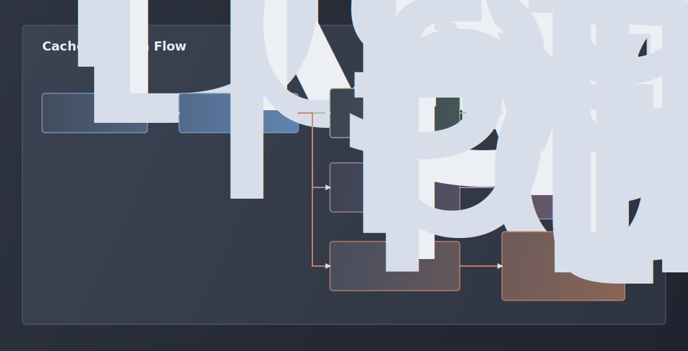

# Performance & Caching

`ib` is built for large Infoblox DNS zones and IPAM read workflows. List and
search commands prefer the selected local or global SQLite cache, DNS record reads use `/allrecords`
to avoid one request per record type, and multi-zone searches run with a bounded
worker pool.

## Quick Model

| Area | Behavior |
| --- | --- |
| Cache scope | DNS rows are keyed by profile, DNS view, and zone. IPAM rows are keyed by profile plus network view or IP. |
| Freshness | Fresh until `cached_at + cache_ttl`; `fresh_until` is not stored. |
| Stale window | Record and targeted IPAM rows can be served stale until `stale_expires_at`; IPAM list/search can serve older cached rows by default. |
| Revalidation | Stale rows return immediately; DNS rows renew locally when cached zone serials match, otherwise background refresh starts are lease-protected and batched for multi-zone search. |
| IPAM refresh | IPAM cache refresh skips serial checks and re-downloads the target WAPI data. Unqualified network list/search merges unscoped network/container rows with per-view rows so all visible IPAM objects are represented. |
| Read endpoint | GET requests use `read_server` when configured. |
| Write endpoint | POST, PUT, and DELETE always use the primary Grid Master. |
| Workers | Global and recursive search load multiple zones in parallel, limited by `dns_search_worker_limit`. |
| Connections | The WAPI HTTP client keeps an idle connection pool sized from `dns_search_worker_limit` for better TLS reuse. |

Default tuning in the profile config `[meta]` section:

| Setting | Default | Meaning |
| --- | ---: | --- |
| `cache_ttl` | `300` seconds | Normal freshness for zone, record, and IPAM cache rows. |
| `records_cache_swr_ttl` | `259200` seconds | How long expired record and IPAM rows can be served stale while revalidating. |
| `dns_search_worker_limit` | `16` | Maximum parallel zone workers during multi-zone search. |
| `max_background_worker_wait` | `3` seconds | Maximum wait for an active same-zone refresh before foreground WAPI work. |
| `completion_cache_prefetch` | `true` | Whether cache-backed shell completion starts background refresh helpers for missing or stale DNS/IPAM context caches. |
| refresh lease TTL | `300` seconds | Local lock lifetime that prevents duplicate refresh subprocesses. |

## Cache Decision Flow



The important performance point is the stale-while-revalidate path: if a record
or IPAM cache row is expired but still inside `records_cache_swr_ttl`, the user
gets cached data immediately. Multi-zone DNS search also reuses cached zone-list
SOA serials: when the zone serial matches the record-cache serial, `ib` renews
the stale record row locally and avoids both a per-zone serial HTTP request and
a detached refresh helper. Stale multi-zone rows that still need background
revalidation are handed to one batch helper instead of one helper process per
zone. `ib net list` and `ib net search` prefer latency even
more aggressively: when network-view, network, or container cache rows exist,
they return those rows even after SWR expiry and queue a background refresh. Use
`--refresh` on those commands when the command must block for fresh WAPI data.
DNS record reads and targeted IPAM reads only block on Infoblox when the row is
missing, changed, serial-less, or already outside the stale window. Before doing
that foreground work, they wait up to `max_background_worker_wait` seconds for
an active refresh of the same cache scope to finish.

For IPAM list/search, cached parent CIDRs are not expanded into synthetic child
rows. Results only include network and container objects returned by Infoblox or
already present in the selected cache.

Shell completion never performs a foreground Infoblox refresh for zone names,
record names, or IPAM network CIDRs. With `completion_cache_prefetch = true`,
cache-backed completion starts only the matching detached refresh helper when
the selected zone-list, record, network-list, or container-list cache row is
missing or stale. Cheap completions for commands, flags, output formats,
columns, sorts, and record types skip SQLite entirely. PTR delete completion
reads cached PTR records from cached reverse zones and completes owner IPs
instead of forward-zone names. With `completion_cache_prefetch = false`,
completion only reads selected cache rows and does not start background refresh
helpers.

## Read, Write, And Worker Flow


Read-only traffic can use a Grid Master Candidate when `ib config new/edit`
finds one that supports read-only WAPI access. Writes never use that endpoint:
create, edit, delete, and zone mutation commands stay on the primary Grid Master.

## What The Workers Do

For a global search, `ib` first loads the searchable zone list, filters out
secondary zones, preloads matching record-cache rows with one SQLite connection,
and then assigns zones to workers. Each worker uses the preloaded row when it is
fresh or inside the SWR window, then falls back to the per-zone cache/WAPI path
only for missing or expired rows. Each per-zone record load:

1. Use the preloaded SQLite row, or open the SQLite cache with a single DB
   connection and `busy_timeout` when a fallback is required.
2. Read the zone's `record_cache` row.
3. Decode JSON records when a cache row exists.
4. Decide fresh, stale-inside-SWR, or expired-outside-SWR.
5. When a multi-zone search has a matching cached zone-list SOA serial, renew
   unchanged stale record rows locally without a per-zone HTTP serial check.
6. For missing, changed, serial-less, or expired-outside-SWR rows, wait briefly for any active same-zone
   refresh lease, then re-read cache if the helper completed.
7. Acquire a refresh lease and launch a detached refresh only when needed.
8. Normalize, deduplicate, sort, and match records by name, value, and comment.

The progress label `Checking cache` covers all of that local work. It can still
take visible time for large cached zones because JSON decoding and record
normalization happen before matching.

## SQLite Cache Tables


`cache_meta` stores cache schema metadata. `zone_cache` caches authoritative
zone list payloads per profile and view. `record_cache` stores `/allrecords`
payloads per profile, view, and zone. `network_view_cache`, `network_cache`,
`network_container_cache`, and `ipv4_address_cache` store IPAM read payloads.
`record_refresh_locks` and `net_refresh_locks` prevent duplicate background
refreshes for the same cache scope.

Cache tables store Infoblox payloads as JSON text. The CLI normalizes those
payloads into typed records or IPAM rows when listing, searching, completing, or
displaying data.

## Cache Updates After Changes

Successful record create, edit, and delete operations remove the affected
zone's record cache row and launch a background revalidation. A/AAAA workflows
that also update PTR records queue refreshes for both the forward and reverse
zones.

Successful DNS zone create and delete operations refresh the zone-list cache in
the background. Deleting a zone removes that zone's record cache instead of
trying to refresh records for a zone that no longer exists.

Use these commands when troubleshooting cache behavior:

```bash
ib config cache status
ib config cache clear
```

Use `IB_SEARCH_DEBUG=1 ib dns search KEYWORD --global` to keep per-zone cache
source lines on stderr after the command finishes. Sources are `fresh cache`,
`stale cache`, `serial-valid cache`, or `allrecords`.
