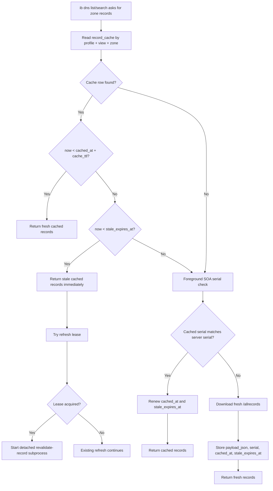
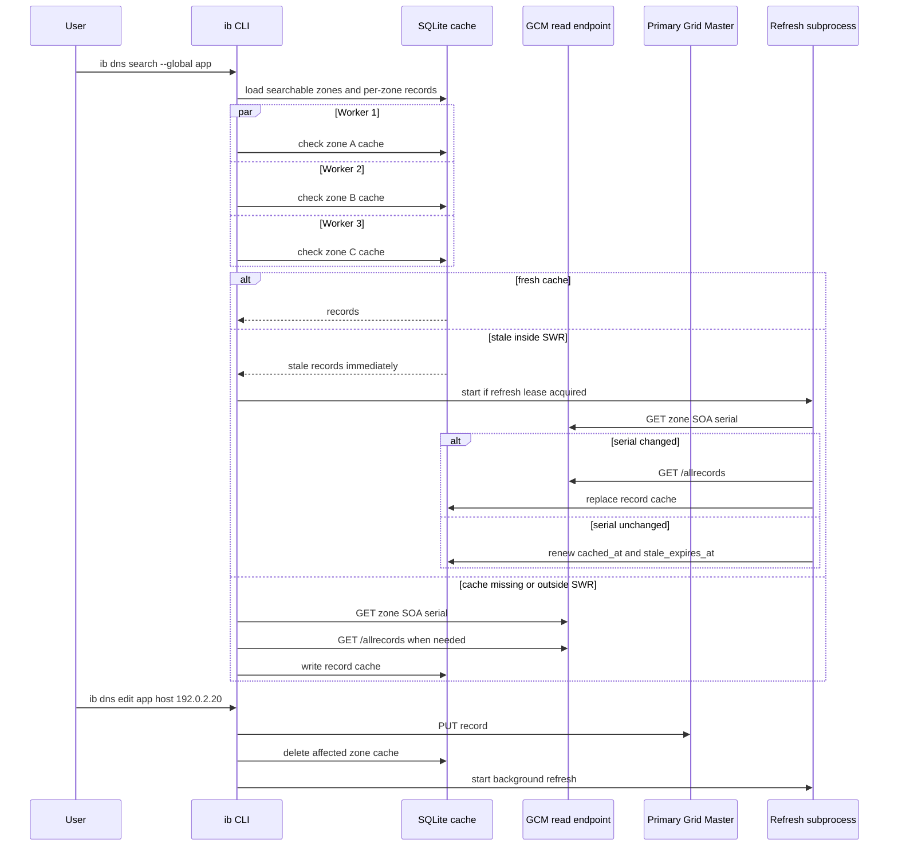
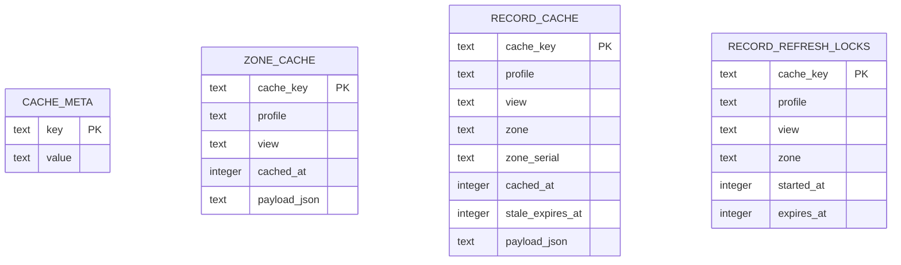

# Performance & Caching

`ib` is built for large Infoblox DNS zones. List and search commands prefer a
local SQLite cache, use `/allrecords` to avoid one request per record type, and
run multi-zone searches with a bounded worker pool.

## Quick Model

| Area | Behavior |
| --- | --- |
| Cache scope | Cache rows are keyed by profile, DNS view, and zone. |
| Freshness | Fresh until `cached_at + cache_ttl`; `fresh_until` is not stored. |
| Stale window | Record rows can be served stale until `stale_expires_at`. |
| Revalidation | Stale rows inside SWR return immediately and start one background refresh. |
| Read endpoint | GET requests use `read_server` when configured. |
| Write endpoint | POST, PUT, and DELETE always use the primary Grid Master. |
| Workers | Global and recursive search load multiple zones in parallel, limited by `dns_search_worker_limit`. |

Default tuning in the profile config `[meta]` section:

| Setting | Default | Meaning |
| --- | ---: | --- |
| `cache_ttl` | `300` seconds | Normal freshness for zone and record cache rows. |
| `records_cache_swr_ttl` | `259200` seconds | How long expired record rows can be served stale while revalidating. |
| `dns_search_worker_limit` | `16` | Maximum parallel zone workers during multi-zone search. |
| refresh lease TTL | `300` seconds | Local lock lifetime that prevents duplicate refresh subprocesses. |

## Cache Decision Flow



The important performance point is the stale-while-revalidate path: if a record
cache row is expired but still inside `records_cache_swr_ttl`, the user gets
cached records immediately. `ib` only blocks on Infoblox when the row is missing
or already outside the stale window.

## Read, Write, And Worker Flow




Read-only traffic can use a Grid Master Candidate when `ib config new/edit`
finds one that supports read-only WAPI access. Writes never use that endpoint:
create, edit, delete, and zone mutation commands stay on the primary Grid Master.

## What The Workers Do

For a global search, `ib` first loads the searchable zone list, filters out
secondary zones, and then assigns zones to workers. Each worker does the same
per-zone record load:

1. Open the SQLite cache with a single DB connection and `busy_timeout`.
2. Read the zone's `record_cache` row.
3. Decode JSON records when a cache row exists.
4. Decide fresh, stale-inside-SWR, or expired-outside-SWR.
5. Acquire a refresh lease and launch a detached refresh only when needed.
6. Normalize, deduplicate, sort, and match records by name, value, and comment.

The progress label `Checking cache` covers all of that local work. It can still
take visible time for large cached zones because JSON decoding and record
normalization happen before matching.

## SQLite Cache Tables



| Table | Purpose | Key columns |
| --- | --- | --- |
| `cache_meta` | Stores cache schema metadata. | `key`, `value` |
| `zone_cache` | Caches authoritative zone list payloads per profile/view. | `profile`, `view`, `cached_at`, `payload_json` |
| `record_cache` | Caches `/allrecords` payloads per profile/view/zone. | `profile`, `view`, `zone`, `zone_serial`, `cached_at`, `stale_expires_at`, `payload_json` |
| `record_refresh_locks` | Prevents duplicate background refreshes for the same profile/view/zone. | `profile`, `view`, `zone`, `started_at`, `expires_at` |

`zone_cache` and `record_cache` store Infoblox payloads as JSON text. The CLI
normalizes those payloads into typed records when listing, searching, completing,
or displaying records.

## Cache Updates After Changes

Successful record create, edit, and delete operations remove the affected
zone's record cache row and launch a background revalidation. A/AAAA workflows
that also update PTR records queue refreshes for both the forward and reverse
zones.

Successful DNS zone create and delete operations refresh the zone-list cache in
the background. Deleting a zone removes that zone's record cache instead of
trying to refresh records for a zone that no longer exists.

Use these commands when troubleshooting cache behavior:

```bash
ib config cache status
ib config cache clear
```
